# connecting-live Design System

You are building UI for **connecting-live**. Dark-themed, cool palette, sans-serif typography (Outfit), compact density on a 4px grid, expressive motion.

## Visual Reference

**IMPORTANT**: Study ALL screenshots below before writing any UI. Match colors, typography, spacing, layout, and motion exactly as shown.

### Homepage

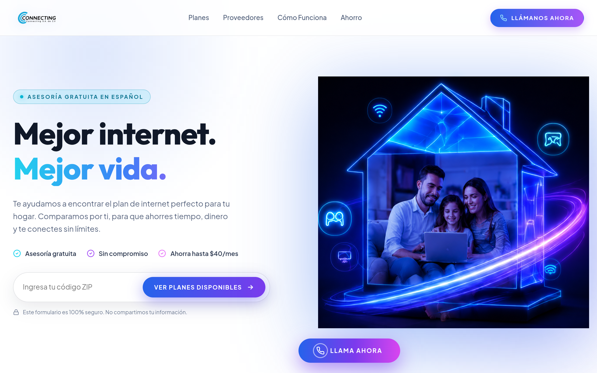

### Scroll Journey (Cinematic Visual States)

> These screenshots capture the website at different scroll depths. The design changes dramatically as you scroll — each frame shows a different cinematic state. Replicate these exact visual transitions.

#### 0% — Hero / Above the fold

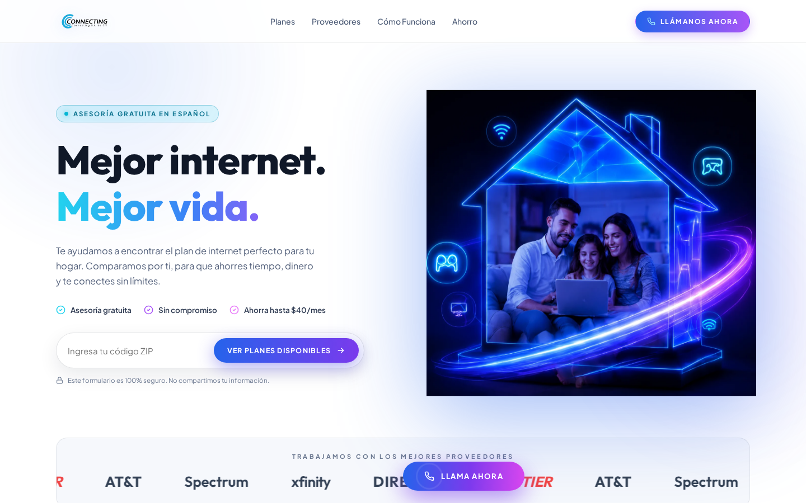

#### 17% — Mid-page at 17% scroll

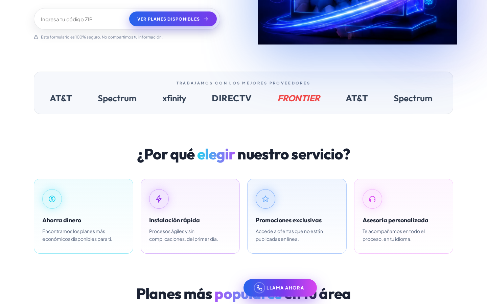

#### 33% — Mid-page at 33% scroll

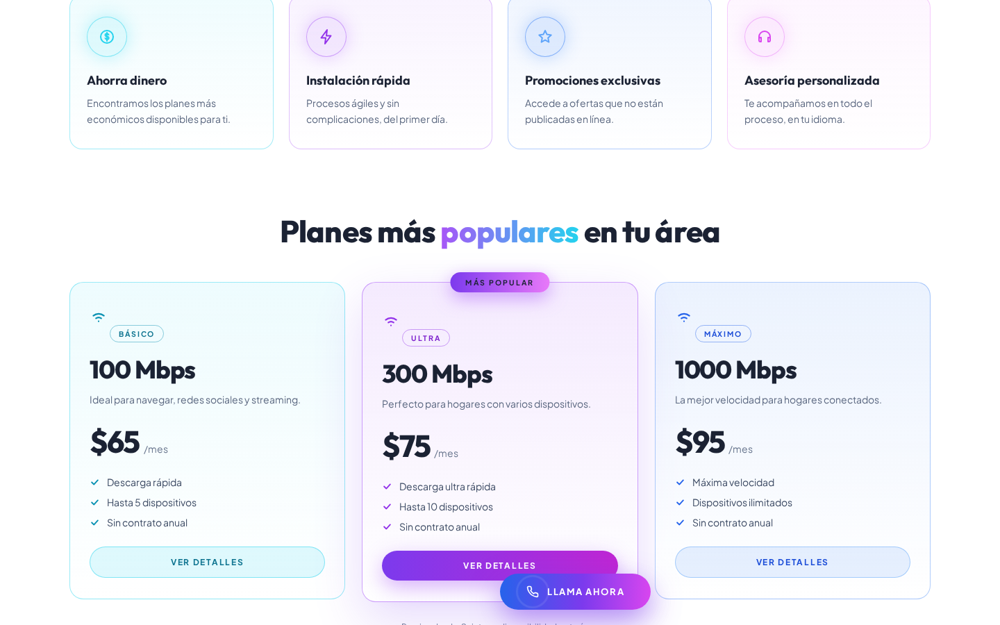

#### 50% — Mid-page at 50% scroll

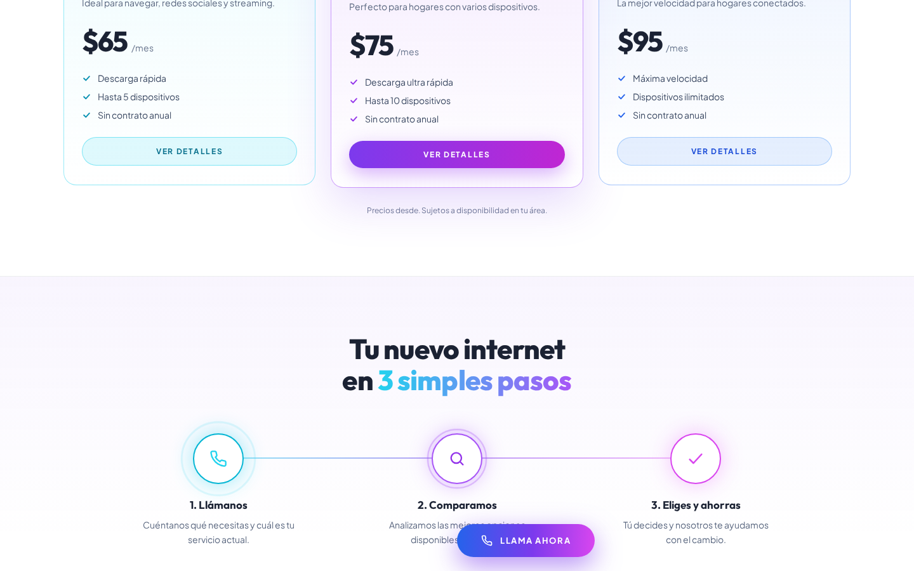

#### 67% — Mid-page at 67% scroll

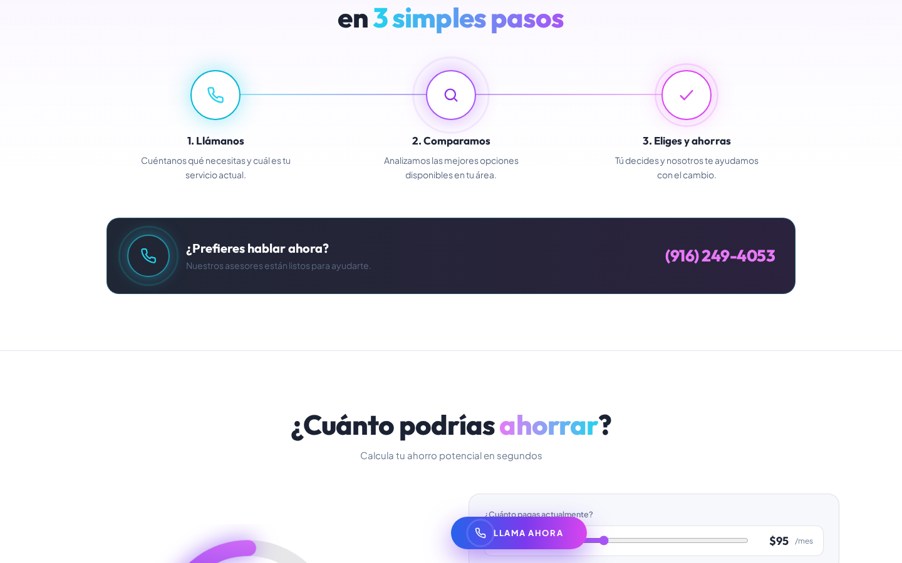

#### 83% — Mid-page at 83% scroll

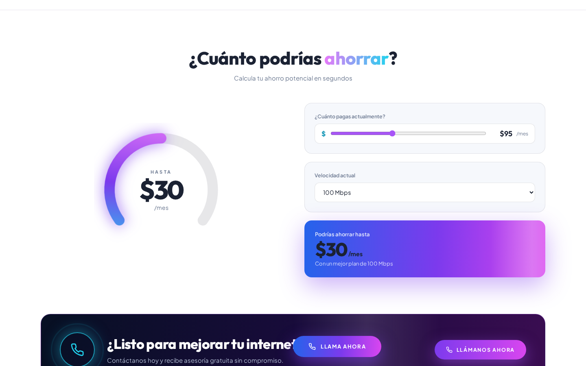

#### 100% — Footer / End of page

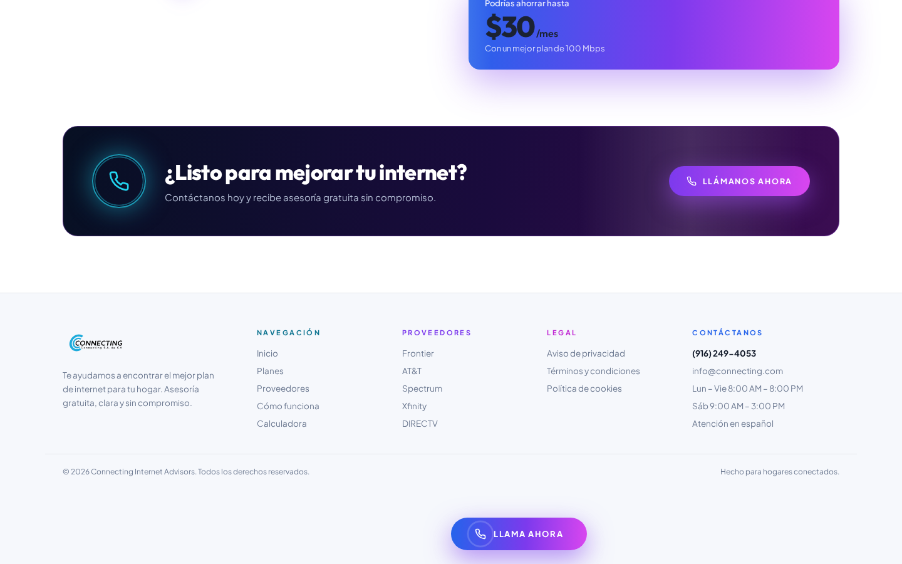

> Read `references/DESIGN.md` for full token details. Read `references/ANIMATIONS.md` for motion specs. Read `references/LAYOUT.md` for layout structure. Read `references/COMPONENTS.md` for component patterns.

## Ultra Reference Files

This package includes extended documentation. **Read these files before implementing:**

| File | Contents |
|------|----------|
| `references/DESIGN.md` | Full design system tokens, colors, typography, spacing |
| `references/VISUAL_GUIDE.md` | **START HERE** — Master visual guide with all screenshots embedded |
| `references/ANIMATIONS.md` | CSS keyframes, scroll triggers, motion library stack, video specs |
| `references/LAYOUT.md` | Flex/grid containers, page structure, spacing relationships |
| `references/COMPONENTS.md` | DOM component patterns, HTML structure, class fingerprints |
| `references/INTERACTIONS.md` | Hover/focus states with before/after style diffs |
| `screens/scroll/` | 7 scroll journey screenshots showing cinematic states |

### Animation Stack Detected

- **Web Animations API (65 active)** — animation

## Design Philosophy

- **Layered depth** — use shadow tokens to create a sense of physical layering. Each elevation level has a specific shadow.
- **Solid colors only** — no gradients anywhere. Every surface is a single flat color.
- **Type pairing** — Outfit for body/UI text, Plus Jakarta Sans for headings/display. Never introduce a third typeface.
- **compact density** — 4px base grid. Every dimension is a multiple of 4.
- **cool palette** — the color temperature runs cool, matching the sans-serif typography.
- **Restrained accent** — `#06b6d4` is the only pop of color. Used exclusively for CTAs, links, focus rings, and active states.
- **Expressive motion** — animations are an integral part of the experience. Use spring physics and layout animations.

## Color System

### Core Palette

| Role | Token | Hex | Use |
|------|-------|-----|-----|
| Background | `--background` | `#1b2233` | Page/app background |
| Surface | `--surface` | `#0f172a` | Cards, panels, modals |
| Text Primary | `--text-primary` | `#ffffff` | Headings, body text |
| Text Muted | `--text-muted` | `#6b7890` | Captions, placeholders |
| Accent | `--accent` | `#06b6d4` | CTAs, links, focus rings |

### Status Colors

| Status | Hex | Use |
|--------|-----|-----|
| Danger | `#ef4444` | Errors, destructive actions |

### Extended Palette

- `#3c4a63`
- `#56637d`
- `#2f3b52`
- `#22d3ee`
- `#a855f7`
- `#0e7490`
- `#7c3aed`
- `#e879f9`

## Typography

### Font Stack

- **Outfit** — Heading 1, Heading 2, Heading 3
- **Plus Jakarta Sans** — Body, Caption

### Font Sources

```css
@font-face {
  font-family: "Outfit";
  src: url("fonts/Outfit-SemiBold.ttf") format("truetype");
  font-weight: 600;
}
@font-face {
  font-family: "Outfit";
  src: url("fonts/Outfit-Bold.ttf") format("truetype");
  font-weight: 700;
}
@font-face {
  font-family: "Outfit";
  src: url("fonts/Outfit-Regular.ttf") format("truetype");
  font-weight: 400;
}
@font-face {
  font-family: "Plus Jakarta Sans";
  src: url("fonts/PlusJakartaSans-SemiBold.ttf") format("truetype");
  font-weight: 600;
}
@font-face {
  font-family: "Plus Jakarta Sans";
  src: url("fonts/PlusJakartaSans-Bold.ttf") format("truetype");
  font-weight: 700;
}
@font-face {
  font-family: "Plus Jakarta Sans";
  src: url("fonts/PlusJakartaSans-Regular.ttf") format("truetype");
  font-weight: 400;
}
```

### Type Scale

| Role | Family | Size | Weight |
|------|--------|------|--------|
| Heading 1 | Outfit | 48px / 3rem | 700 |
| Heading 2 | Outfit | 32px / 2rem | 600 |
| Heading 3 | Outfit | 24px / 1.5rem | 600 |
| Body | Plus Jakarta Sans | 16px / 1rem | 400 |
| Caption | Plus Jakarta Sans | 12px / 0.75rem | 400 |

### Typography Rules

- Body/UI: **Outfit**, Headings: **Plus Jakarta Sans** — these are the only display fonts
- Max 3-4 font sizes per screen
- Headings: weight 600-700, body: weight 400
- Use color and opacity for text hierarchy, not additional font sizes
- Line height: 1.5 for body, 1.2 for headings

## Spacing & Layout

### Base Grid: 4px

Every dimension (margin, padding, gap, width, height) must be a multiple of **4px**.

### Spacing Scale

`2, 4, 6, 8, 10, 12, 14, 16, 18, 20, 22, 24` px

### Spacing as Meaning

| Spacing | Use |
|---------|-----|
| 4-8px | Tight: related items (icon + label, avatar + name) |
| 12-16px | Medium: between groups within a section |
| 24-32px | Wide: between distinct sections |
| 48px+ | Vast: major page section breaks |

### Border Radius

Scale: `12px, 18px, 20px, 24px, 999px`
Default: `20px`

### Container

Max-width: `960px`, centered with auto margins.

### Breakpoints

| Name | Value |
|------|-------|
| xs | 420px |
| sm | 640px |
| lg | 960px |

Mobile-first: design for small screens, layer on responsive overrides.

## Component Patterns

### Card

```css
.card {
  background: #0f172a;
  border-radius: 20px;
  padding: 16px;
  box-shadow: rgba(124, 58, 237, 0.28) 0px 6px 18px 0px;
}
```

```html
<div class="card">
  <h3>Card Title</h3>
  <p>Card content goes here.</p>
</div>
```

### Button

```css
/* Primary */
.btn-primary {
  background: #06b6d4;
  color: #ffffff;
  border-radius: 20px;
  padding: 8px 16px;
  font-weight: 500;
  transition: opacity 150ms ease;
}
.btn-primary:hover { opacity: 0.9; }

/* Ghost */
.btn-ghost {
  background: transparent;
  border: 1px solid #444444;
  color: #ffffff;
  border-radius: 20px;
  padding: 8px 16px;
}
```

```html
<button class="btn-primary">Get Started</button>
<button class="btn-ghost">Learn More</button>
```

### Input

```css
.input {
  background: #1b2233;
  border: 1px solid #444444;
  border-radius: 20px;
  padding: 8px 12px;
  color: #ffffff;
  font-size: 14px;
}
.input:focus { border-color: #06b6d4; outline: none; }
```

```html
<input class="input" type="text" placeholder="Search..." />
```

### Badge / Chip

```css
.badge {
  display: inline-flex;
  align-items: center;
  padding: 4px 8px;
  border-radius: 9999px;
  font-size: 12px;
  font-weight: 500;
  background: #0f172a;
  color: #6b7890;
}
```

```html
<span class="badge">New</span>
<span class="badge">Beta</span>
```

### Modal / Dialog

```css
.modal-backdrop { background: rgba(0, 0, 0, 0.6); }
.modal {
  background: #0f172a;
  border-radius: 999px;
  padding: 24px;
  max-width: 480px;
  width: 90vw;
  box-shadow: rgba(124, 58, 237, 0.28) 0px 6px 18px 0px;
}
```

```html
<div class="modal-backdrop">
  <div class="modal">
    <h2>Dialog Title</h2>
    <p>Dialog content.</p>
    <button class="btn-primary">Confirm</button>
    <button class="btn-ghost">Cancel</button>
  </div>
</div>
```

### Table

```css
.table { width: 100%; border-collapse: collapse; }
.table th {
  text-align: left;
  padding: 8px 12px;
  font-weight: 500;
  font-size: 12px;
  color: #6b7890;
  text-transform: uppercase;
  letter-spacing: 0.05em;
  border-bottom: 1px solid #444444;
}
.table td {
  padding: 12px;
  border-bottom: 1px solid #444444;
}
```

```html
<table class="table">
  <thead><tr><th>Name</th><th>Status</th><th>Date</th></tr></thead>
  <tbody>
    <tr><td>Item One</td><td>Active</td><td>Jan 1</td></tr>
    <tr><td>Item Two</td><td>Pending</td><td>Jan 2</td></tr>
  </tbody>
</table>
```

### Navigation

```css
.nav {
  display: flex;
  align-items: center;
  gap: 8px;
  padding: 12px 16px;
}
.nav-link {
  color: #6b7890;
  padding: 8px 12px;
  border-radius: 20px;
  transition: color 150ms;
}
.nav-link:hover { color: #ffffff; }
.nav-link.active { color: #06b6d4; }
```

```html
<nav class="nav">
  <a href="/" class="nav-link active">Home</a>
  <a href="/about" class="nav-link">About</a>
  <a href="/pricing" class="nav-link">Pricing</a>
  <button class="btn-primary" style="margin-left: auto">Get Started</button>
</nav>
```

## Page Structure

The following page sections were detected:

- **Navigation** — Top navigation bar (6 items)
- **Hero** — Hero/banner section with headline and CTAs
- **Features** — Feature/benefit cards grid
- **Footer** — Page footer with links and info (10 items)
- **Cta** — Call-to-action section

When building pages, follow this section order and structure.

## Animation & Motion

This project uses **expressive motion**. Animations are part of the design language.

### CSS Animations

- `floaty`
- `floaty2`
- `breathe`
- `orbit`
- `marquee`

### Motion Tokens

- **Duration scale:** `.001ms`

### Motion Guidelines

- **Duration:** Use values from the duration scale above. Short (.001ms) for micro-interactions, long (.001ms) for page transitions
- **Easing:** `ease-out` for enters, `ease-in` for exits
- **Direction:** Elements enter from bottom/right, exit to top/left
- **Reduced motion:** Always respect `prefers-reduced-motion` — disable animations when set

## Depth & Elevation

### Shadow Tokens

- Floating (dropdowns, popovers): `rgba(124, 58, 237, 0.28) 0px 6px 18px 0px`
- Floating (dropdowns, popovers): `rgba(6, 182, 212, 0.8) 0px 0px 12px 0px`
- Floating (dropdowns, popovers): `rgb(34, 211, 238) 0px 0px 20px 0px`
- Overlay (modals, dialogs): `rgba(124, 58, 237, 0.55) 0px 14px 40px 0px`
- Overlay (modals, dialogs): `rgba(168, 85, 247, 0.45) 0px 10px 30px 0px`
- Overlay (modals, dialogs): `rgba(168, 85, 247, 0.5) 0px 12px 36px 0px`

## Anti-Patterns (Never Do)

- **No gradients** — solid colors only, everywhere
- **No blur effects** — no backdrop-blur, no filter: blur()
- **No zebra striping** — tables and lists use borders for separation
- **No invented colors** — every hex value must come from the palette above
- **No arbitrary spacing** — every dimension is a multiple of 4px
- **No extra fonts** — only Outfit and Plus Jakarta Sans are allowed
- **No arbitrary border-radius** — use the scale: 12px, 18px, 20px, 24px, 999px
- **No opacity for disabled states** — use muted colors instead

## Workflow

1. **Read** `references/DESIGN.md` before writing any UI code
2. **Pick colors** from the Color System section — never invent new ones
3. **Set typography** — Outfit, Plus Jakarta Sans only, using the type scale
4. **Build layout** on the 4px grid — check every margin, padding, gap
5. **Match components** to patterns above before creating new ones
6. **Apply elevation** — use shadow tokens
7. **Validate** — every value traces back to a design token. No magic numbers.

## Brand Spec

- **Favicon:** `/favicon.ico`
- **Site URL:** `https://pagina-alexis-1-residencial.onrender.com`
- **Brand color:** `#06b6d4`
- **Brand typeface:** Outfit

## Quick Reference

```
Background:     #1b2233
Surface:        #0f172a
Text:           #ffffff / #6b7890
Accent:         #06b6d4
Border:         (not extracted)
Font:           Outfit
Spacing:        4px grid
Radius:         20px
Components:     7 detected
```

## When to Trigger

Activate this skill when:
- Creating new components, pages, or visual elements for connecting-live
- Writing CSS, Tailwind classes, styled-components, or inline styles
- Building page layouts, templates, or responsive designs
- Reviewing UI code for design consistency
- The user mentions "connecting-live" design, style, UI, or theme
- Generating mockups, wireframes, or visual prototypes

---

# Full Reference Files

> Every output file is embedded below. Claude has full design system context from /skills alone.

## Design System Tokens (DESIGN.md)

# connecting-live DESIGN.md

> Auto-generated design system — reverse-engineered via static analysis by skillui.
> Frameworks: None detected
> Colors: 20 · Fonts: 2 · Components: 7
> Icon library: not detected · State: not detected
> Primary theme: dark · Dark mode toggle: no · Motion: expressive

## Visual Reference

**Match this design exactly** — study colors, fonts, spacing, and component shapes before writing any UI code.


---

## 1. Visual Theme & Atmosphere

This is a **dark-themed** interface with a cool tone. Depth is expressed through layered shadows and subtle surface color variation. Typography pairs **Plus Jakarta Sans** for display/headings with **Outfit** for body text, creating clear visual hierarchy through type contrast. Spacing follows a **4px base grid** (compact density), with scale: 2, 4, 6, 8, 10, 12, 14, 16px. The palette is predominantly monochromatic with **#06b6d4** as the single accent color — used sparingly for interactive elements and emphasis. Motion is expressive — spring physics, layout animations, and staggered reveals are part of the visual language.

---

## 2. Color Palette & Roles

| Token | Hex | Role | Use |
|---|---|---|---|
| background | `#1b2233` | background | Page background, darkest surface |
| surface | `#0f172a` | surface | Card and panel backgrounds |
| text-primary | `#ffffff` | text-primary | Headings and body text |
| text-muted | `#6b7890` | text-muted | Captions, placeholders, secondary info |
| accent | `#06b6d4` | accent | CTAs, links, focus rings, active states |
| danger | `#ef4444` | danger | Error states, destructive actions |
| info | `#22d3ee` | info | Informational highlights |
| unknown | `#3c4a63` | unknown | Palette color |
| unknown | `#56637d` | unknown | Palette color |
| unknown | `#2f3b52` | unknown | Palette color |
| unknown | `#a855f7` | unknown | Palette color |
| unknown | `#0e7490` | unknown | Palette color |
| unknown | `#7c3aed` | unknown | Palette color |
| unknown | `#e879f9` | unknown | Palette color |
| unknown | `#4b5a75` | unknown | Palette color |
| unknown | `#3b82f6` | unknown | Palette color |
| unknown | `#2563eb` | unknown | Palette color |
| unknown | `#0891b2` | unknown | Palette color |
| unknown | `#1d4ed8` | unknown | Palette color |
| unknown | `#d946ef` | unknown | Palette color |


---

## 3. Typography Rules

**Font Stack:**
- **Outfit** — Heading 1, Heading 2, Heading 3
- **Plus Jakarta Sans** — Body, Caption

**Font Sources:**

```css
@font-face {
  font-family: "Outfit";
  src: url("fonts/Outfit-SemiBold.ttf") format("truetype");
  font-weight: 600;
}
@font-face {
  font-family: "Outfit";
  src: url("fonts/Outfit-Bold.ttf") format("truetype");
  font-weight: 700;
}
@font-face {
  font-family: "Outfit";
  src: url("fonts/Outfit-Regular.ttf") format("truetype");
  font-weight: 400;
}
@font-face {
  font-family: "Plus Jakarta Sans";
  src: url("fonts/PlusJakartaSans-SemiBold.ttf") format("truetype");
  font-weight: 600;
}
@font-face {
  font-family: "Plus Jakarta Sans";
  src: url("fonts/PlusJakartaSans-Bold.ttf") format("truetype");
  font-weight: 700;
}
@font-face {
  font-family: "Plus Jakarta Sans";
  src: url("fonts/PlusJakartaSans-Regular.ttf") format("truetype");
  font-weight: 400;
}
```

| Role | Font | Size | Weight |
|---|---|---|---|
| Heading 1 | Outfit | 48px / 3rem | 700 |
| Heading 2 | Outfit | 32px / 2rem | 600 |
| Heading 3 | Outfit | 24px / 1.5rem | 600 |
| Body | Plus Jakarta Sans | 16px / 1rem | 400 |
| Caption | Plus Jakarta Sans | 12px / 0.75rem | 400 |

**Typographic Rules:**
- Limit to 2 font families max per screen
- Use **Outfit** for body/UI text, **Plus Jakarta Sans** for display/headings
- Maintain consistent hierarchy: no more than 3-4 font sizes per screen
- Headings use bold (600-700), body uses regular (400)
- Line height: 1.5 for body text, 1.2 for headings
- Use color and opacity for secondary hierarchy, not additional font sizes


---

## 4. Component Stylings

### Layout (1)

**Footer** — `html`

### Navigation (1)

**Navigation** — `html`

### Data Display (1)

**List** — `html`

### Data Input (2)

**Button** — `html`

**Input** — `html`
- State: :focus, :placeholder

### Media (2)

**Image** — `html`

**Icon** — `html`


---

## 5. Layout Principles

- **Base spacing unit:** 4px
- **Spacing scale:** 2, 4, 6, 8, 10, 12, 14, 16, 18, 20, 22, 24
- **Border radius:** 12px, 18px, 20px, 24px, 999px
- **Max content width:** 960px

**Spacing as Meaning:**
| Spacing | Use |
|---|---|
| 4-8px | Tight: related items within a group |
| 12-16px | Medium: between groups |
| 24-32px | Wide: between sections |
| 48px+ | Vast: major section breaks |


---

## 6. Depth & Elevation

### Floating — dropdowns, popovers, modals

- `rgba(124, 58, 237, 0.28) 0px 6px 18px 0px`
- `rgba(6, 182, 212, 0.8) 0px 0px 12px 0px`
- `rgb(34, 211, 238) 0px 0px 20px 0px`

### Overlay — full-screen overlays, top-level dialogs

- `rgba(124, 58, 237, 0.55) 0px 14px 40px 0px`
- `rgba(168, 85, 247, 0.45) 0px 10px 30px 0px`
- `rgba(168, 85, 247, 0.5) 0px 12px 36px 0px`


---

## 7. Animation & Motion

This project uses **expressive motion**. Animations are an integral part of the experience.

### CSS Animations

- `@keyframes floaty`
- `@keyframes floaty2`
- `@keyframes breathe`
- `@keyframes orbit`
- `@keyframes marquee`
- `@keyframes sweep`
- `@keyframes zeReveal`
- `@keyframes zeDrop`

### Motion Guidelines

- Duration: 150-300ms for micro-interactions, 300-500ms for page transitions
- Easing: `ease-out` for enters, `ease-in` for exits
- Always respect `prefers-reduced-motion`


---

## 8. Do's and Don'ts

### Do's

- Use `#06b6d4` for interactive elements (buttons, links, focus rings)
- Use `#1b2233` as the primary page background
- Pair **Outfit** (body) with **Plus Jakarta Sans** (display) — these are the only allowed fonts
- Follow the **4px** spacing grid for all margins, padding, and gaps
- Use the defined shadow tokens for elevation — see Section 6
- Use border-radius from the scale: 12px, 18px, 20px, 24px, 999px
- Reuse existing components from Section 4 before creating new ones

### Don'ts

- Don't introduce colors outside this palette — extend the design tokens first
- Don't introduce additional font families beyond Outfit and Plus Jakarta Sans
- Don't use arbitrary spacing values — stick to multiples of 4px
- Don't create custom box-shadow values outside the system tokens
- Don't use gradients — the design uses solid colors only
- Don't use arbitrary border-radius values — pick from the defined scale
- Don't duplicate component patterns — check Section 4 first
- Don't use backdrop-blur or blur effects

### Anti-Patterns (detected from codebase)

- No gradient backgrounds
- No blur or backdrop-blur effects
- No zebra striping on tables/lists


---

## 9. Responsive Behavior

| Name | Value | Source |
|---|---|---|
| xs | 420px | css |
| sm | 640px | css |
| lg | 960px | css |

**Approach:** Use `@media (min-width: ...)` queries matching the breakpoints above.


---

## 10. Agent Prompt Guide

Use these as starting points when building new UI:

### Build a Card

```
Background: #0f172a
Border: 1px solid var(--border)
Radius: 20px
Padding: 16px
Font: Outfit
Use shadow tokens from Section 6.
```

### Build a Button

```
Primary: bg #06b6d4, text white
Ghost: bg transparent, border var(--border)
Padding: 8px 16px
Radius: 20px
Hover: opacity 0.9 or lighter shade
Focus: ring with #06b6d4
```

### Build a Page Layout

```
Background: #1b2233
Max-width: 960px, centered
Grid: 4px base
Responsive: mobile-first, breakpoints from Section 9
```

### Build a Stats Card

```
Surface: #0f172a
Label: #6b7890 (muted, 12px, uppercase)
Value: #ffffff (primary, 24-32px, bold)
Status: use success/warning/danger from Section 2
```

### Build a Form

```
Input bg: #1b2233
Input border: 1px solid var(--border)
Focus: border-color #06b6d4
Label: #6b7890 12px
Spacing: 16px between fields
Radius: 20px
```

### General Component

```
1. Read DESIGN.md Sections 2-6 for tokens
2. Colors: only from palette
3. Font: Outfit, type scale from Section 3
4. Spacing: 4px grid
5. Components: match patterns from Section 4
6. Elevation: shadow tokens
```

## Visual Guide — Screenshots (VISUAL_GUIDE.md)

# connecting-live — Visual Guide

> Master visual reference. Study every screenshot carefully before implementing any UI.
> Match colors, layout, typography, spacing, and motion states exactly.

**Motion Stack:** **Web Animations API (65 active)**

## Scroll Journey

The page has cinematic scroll animations. Each screenshot below shows the exact visual state at that scroll depth.
**Replicate these transitions precisely** — the design changes dramatically as you scroll.

### Hero — Above the fold

*Scroll position: 0px of 4256px total*


### 17% scroll depth

*Scroll position: 571px of 4256px total*


### 33% scroll depth

*Scroll position: 1107px of 4256px total*


### 50% scroll depth

*Scroll position: 1678px of 4256px total*


### 67% scroll depth

*Scroll position: 2249px of 4256px total*


### 83% scroll depth

*Scroll position: 2785px of 4256px total*


### Footer — End of page

*Scroll position: 3356px of 4256px total*


## Full Page Screenshots

### home

*URL: `https://pagina-alexis-1-residencial.onrender.com`*


## Section Screenshots

Clipped sections showing individual components in context.

### Section 1 — `section`

*1296×684px*


### Section 2 — `section`

*1296×218px*


## Animations & Motion (ANIMATIONS.md)

# Animation Reference

> Cinematic motion design extracted from live DOM. Follow these specs exactly to recreate the experience.

## Motion Technology Stack

| Library | Type | Notes |
|---------|------|-------|
| **Web Animations API (65 active)** | animation |  |

## Scroll Journey

The page is **4,256px** tall. Each frame below shows what the user sees at that scroll depth.

> **Use these screenshots to understand WHAT animates, WHEN it animates, and HOW it moves.**

### 0% — Top / Hero
Scroll position: 0px


### 17% — Opening Section
Scroll position: 571px


### 33% — First Feature Section
Scroll position: 1,107px


### 50% — Mid-Page
Scroll position: 1,678px


### 67% — Lower Content
Scroll position: 2,249px


### 83% — Near Footer
Scroll position: 2,785px


### 100% — Bottom / Footer
Scroll position: 3,356px


## Scroll Animation Patterns

| Pattern | Library | Element Count | Duration | Delay | Easing |
|---------|---------|---------------|----------|-------|--------|
| parallax / sticky scroll | CSS | 1 | — | — | — |

### CSS Implementation

## CSS Keyframes (12 extracted)

### `@keyframes sc-shine`

Duration: `1.4s` · Easing: `ease` · Delay: `0s` · Iteration: `infinite` · Fill: `none`

Used by: `html.sc-dc-streaming .sc-placeholder::before, html.sc-dc-streaming .sc-interp.sc`

```css
@keyframes sc-shine {
  0% {
    background-position-x: 100%;
    background-position-y: 50%;
  }
  100% {
    background-position-x: 0%;
    background-position-y: 50%;
  }
}
```

> Background color/gradient shift · Background position (shimmer/scroll)

### `@keyframes floaty`

```css
@keyframes floaty {
  0%, 100% {
    transform: translateY(0px);
  }
  50% {
    transform: translateY(-14px);
  }
}
```

> Transform/motion animation

### `@keyframes floaty2`

```css
@keyframes floaty2 {
  0%, 100% {
    transform: translateY(0px);
  }
  50% {
    transform: translateY(12px);
  }
}
```

> Transform/motion animation

### `@keyframes breathe`

```css
@keyframes breathe {
  0%, 100% {
    opacity: 0.45;
    transform: scale(1);
  }
  50% {
    opacity: 0.85;
    transform: scale(1.06);
  }
}
```

> Fade + motion enter animation

### `@keyframes orbit`

```css
@keyframes orbit {
  0% {
    transform: rotate(0deg);
  }
  100% {
    transform: rotate(360deg);
  }
}
```

> Transform/motion animation

### `@keyframes marquee`

```css
@keyframes marquee {
  0% {
    transform: translateX(0px);
  }
  100% {
    transform: translateX(-50%);
  }
}
```

> Transform/motion animation

### `@keyframes sweep`

```css
@keyframes sweep {
  0% {
    transform: translateX(-120%);
  }
  60%, 100% {
    transform: translateX(220%);
  }
}
```

> Transform/motion animation

### `@keyframes zeReveal`

```css
@keyframes zeReveal {
  0% {
    opacity: 0;
    transform: translateY(26px) scale(0.985);
    filter: blur(7px);
  }
  100% {
    opacity: 1;
    transform: none;
    filter: blur(0px);
  }
}
```

> Fade + motion enter animation · Filter effect (blur/brightness)

### `@keyframes zeDrop`

```css
@keyframes zeDrop {
  0% {
    opacity: 0;
    transform: translateY(-16px) scale(0.9);
  }
  100% {
    opacity: 1;
    transform: none;
  }
}
```

> Fade + motion enter animation

### `@keyframes zeBgSettle`

```css
@keyframes zeBgSettle {
  0% {
    opacity: 0;
    transform: scale(1.12);
  }
  100% {
    opacity: 1;
    transform: scale(1);
  }
}
```

> Fade + motion enter animation

### `@keyframes zePop`

```css
@keyframes zePop {
  0% {
    opacity: 0;
    transform: translateY(8px) scale(0.78);
  }
  70% {
    opacity: 1;
    transform: scale(1.07);
  }
  100% {
    opacity: 1;
    transform: scale(1);
  }
}
```

> Fade + motion enter animation

### `@keyframes pulsering`

```css
@keyframes pulsering {
  0% {
    transform: scale(0.9);
    opacity: 0.7;
  }
  100% {
    transform: scale(1.7);
    opacity: 0;
  }
}
```

> Fade + motion enter animation

## How to Recreate This Motion Design

### Step 1 — Install Dependencies

```bash
```

### Step 2 — Scroll-Reveal Pattern

Elements that animate into view follow this pattern:

```css
/* Initial hidden state */
.reveal {
  opacity: 0;
  transform: translateY(40px);
  transition: opacity 0.6s cubic-bezier(0.4, 0, 0.2, 1),
              transform 0.6s cubic-bezier(0.4, 0, 0.2, 1);
}
.reveal.visible {
  opacity: 1;
  transform: translateY(0);
}
```

### Step 3 — Key Motion Principles

- **Always add** `@media (prefers-reduced-motion: reduce) { * { animation-duration: 0.01ms !important; transition-duration: 0.01ms !important; } }`

### Step 4 — Scroll Journey Reference

Match what happens at each scroll position:

- **0%** (`0px`) → `screens/scroll/scroll-000.png`
- **17%** (`571px`) → `screens/scroll/scroll-017.png`
- **33%** (`1107px`) → `screens/scroll/scroll-033.png`
- **50%** (`1678px`) → `screens/scroll/scroll-050.png`
- **67%** (`2249px`) → `screens/scroll/scroll-067.png`
- **83%** (`2785px`) → `screens/scroll/scroll-083.png`
- **100%** (`3356px`) → `screens/scroll/scroll-100.png`

## Layout & Grid (LAYOUT.md)

# Layout Reference

> Auto-extracted from live DOM. Use this to understand how the site is structured spatially.

## Spacing System

**Base grid:** 4px

**Scale:** `2, 4, 6, 8, 10, 12, 14, 16, 18, 20, 22, 24, 26, 28, 30` px

| Spacing | Semantic Use |
|---------|-------------|
| 4px | Tight — within a component |
| 8px | Medium — between sibling items |
| 16px | Wide — between sections |
| 32px | Vast — major section breaks |

## Flex Layouts

| Element | Direction | Justify | Align | Gap | Children |
|---------|-----------|---------|-------|-----|----------|
| `nav.site-nav` | row | space-between | center | 24px | 3 |
| `div.hero-search` | row | — | center | 10px | 2 |

## Grid Layouts

| Element | Template Columns | Gap | Children |
|---------|-----------------|-----|----------|
| `section#top.hero-grid` | `625.797px 566.203px` | 48px | 2 |
| `div.benefits-grid` | `293.5px 293.5px 293.5px 293.5px` | 22px | 4 |
| `div.plans-grid` | `397.328px 397.328px 397.344px` | 24px | 3 |
| `div.ahorro-grid` | `592px 592px` | 56px | 2 |
| `div.footer-grid` | `274px 195.703px 195.719px 195.719px 234.844px` | 36px | 5 |
| `div.hero-visual` | `566.203px` | — | 4 |
| `div.steps-grid` | `348px 348px 348px` | 28px | 4 |

## Structural Containers

### `<header>` 

```
display:          block
children:         1
```

### `<footer>` 

```
display:          block
padding:          0px 0px 100px
children:         2
```

### `<section>` (`section#top.hero-grid`)

```
display:          grid
grid-template-columns: 625.797px 566.203px
gap:              48px
padding:          78px 28px 40px
max-width:        1240px
children:         2
```

### `<section>` (`section#proveedores`)

```
display:          block
padding:          22px 28px 70px
max-width:        1240px
children:         1
```

### `<section>` (`section#beneficios`)

```
display:          block
padding:          20px 28px 90px
max-width:        1240px
children:         2
```

### `<section>` (`section#planes`)

```
display:          block
padding:          0px 28px 96px
max-width:        1240px
children:         3
```

### `<section>` (`section#pasos`)

```
display:          block
padding:          90px 0px
children:         1
```

### `<section>` (`section#ahorro`)

```
display:          block
padding:          90px 28px
max-width:        1240px
children:         3
```

### `<section>` 

```
display:          block
padding:          0px 28px 90px
max-width:        1240px
children:         1
```

### `<nav>` (`nav.site-nav`)

```
display:          flex
flex-direction:   row
justify-content:  space-between
align-items:      center
gap:              24px
padding:          16px 28px
max-width:        1240px
children:         3
```

## Layout Rules

- **Container max-width:** `1240px` — always center with `margin: auto`
- Primary layout system: **Flexbox**
- Secondary layout system: **CSS Grid** (used for card grids and multi-column layouts)
- Every spacing value must be a multiple of **4px**
- Never use arbitrary margin/padding values outside the spacing scale

## Component Patterns (COMPONENTS.md)

# Component Reference

> Repeated DOM patterns detected by structural analysis. Each component appeared 3+ times.

No repeated components detected (Playwright required).

## Interactions & States (INTERACTIONS.md)

# Interaction Reference

> Micro-interactions extracted from live DOM. Recreate these exactly for authentic feel.

## Coverage

| Component Type | Count | States Captured |
|----------------|-------|----------------|
| Button | 1 | default, hover, focus |
| Link | 3 | default, hover, focus |
| Input | 2 | default, hover, focus |

## Transition System

These transition declarations were extracted from interactive elements:

```css
transition: transform 0.25s, box-shadow 0.25s;
transition: all;
```

Apply these to all interactive elements. Never invent new durations or easings.

## Button Interactions

### Button 1 — `VER PLANES DISPONIBLES`

**States:**

- Default: `../screens/states/button-1-default.png`
- Hover: `../screens/states/button-1-hover.png`
- Focus: `../screens/states/button-1-focus.png`

**On hover:**

```css
/* box-shadow: rgba(79, 70, 229, 0.45) 0px 8px 30px 0px → */ box-shadow: rgba(124, 58, 237, 0.6) 0px 14px 40px 0px;
/* transform: none → */ transform: matrix(1, 0, 0, 1, 0, -2);
```

**On focus:**

```css
/* outline: rgb(255, 255, 255) none 3px → */ outline: rgb(16, 16, 16) auto 1px;
/* outline-color: rgb(255, 255, 255) → */ outline-color: rgb(16, 16, 16);
```

**Transition:** `transform 0.25s, box-shadow 0.25s`

## Link Interactions

### Link 1 — `LLAMA AHORA`

**States:**

- Default: `../screens/states/link-1-default.png`
- Hover: `../screens/states/link-1-hover.png`
- Focus: `../screens/states/link-1-focus.png`

**On hover:**

```css
/* box-shadow: rgba(124, 58, 237, 0.55) 0px 14px 40px 0px → */ box-shadow: rgba(168, 85, 247, 0.65) 0px 18px 50px 0px;
/* transform: matrix(1, 0, 0, 1, 0, 0) → */ transform: matrix(1, 0, 0, 1, -108.586, -3);
```

**On focus:**

```css
/* outline: rgb(255, 255, 255) none 3px → */ outline: rgb(16, 16, 16) auto 1px;
/* outline-color: rgb(255, 255, 255) → */ outline-color: rgb(16, 16, 16);
```

**Transition:** `transform 0.25s, box-shadow 0.25s`

### Link 2 — `LLÁMANOS AHORA`

**States:**

- Default: `../screens/states/link-2-default.png`
- Hover: `../screens/states/link-2-hover.png`
- Focus: `../screens/states/link-2-focus.png`

**On hover:**

```css
/* box-shadow: rgba(124, 58, 237, 0.28) 0px 6px 18px 0px → */ box-shadow: rgba(168, 85, 247, 0.45) 0px 10px 26px 0px;
```

**On focus:**

```css
/* outline: rgb(255, 255, 255) none 3px → */ outline: rgb(16, 16, 16) auto 1px;
/* outline-color: rgb(255, 255, 255) → */ outline-color: rgb(16, 16, 16);
```

**Transition:** `all`

### Link 3 — `VER DETALLES`

**States:**

- Default: `../screens/states/link-3-default.png`
- Hover: `../screens/states/link-3-hover.png`
- Focus: `../screens/states/link-3-focus.png`

**On hover:**

```css
/* background-color: rgba(34, 211, 238, 0.14) → */ background-color: rgba(34, 211, 238, 0.28);
/* color: rgb(14, 116, 144) → */ color: rgb(12, 74, 110);
/* outline: rgb(14, 116, 144) none 3px → */ outline: rgb(12, 74, 110) none 3px;
/* outline-color: rgb(14, 116, 144) → */ outline-color: rgb(12, 74, 110);
```

**On focus:**

```css
/* outline: rgb(14, 116, 144) none 3px → */ outline: rgb(16, 16, 16) auto 1px;
/* outline-color: rgb(14, 116, 144) → */ outline-color: rgb(16, 16, 16);
```

**Transition:** `all`

## Input Interactions

### Input 1 — `Ingresa tu código ZIP`

**States:**

- Default: `../screens/states/input-1-default.png`
- Hover: `../screens/states/input-1-hover.png`
- Focus: `../screens/states/input-1-focus.png`

**Transition:** `all`

_No visible style changes detected for this element._

### Input 2 — `range`

**States:**

- Default: `../screens/states/input-2-default.png`
- Hover: `../screens/states/input-2-hover.png`
- Focus: `../screens/states/input-2-focus.png`

**On focus:**

```css
/* outline: rgb(157, 150, 142) none 3px → */ outline: rgb(16, 16, 16) auto 1px;
/* outline-color: rgb(157, 150, 142) → */ outline-color: rgb(16, 16, 16);
```

**Transition:** `all`

## Interaction Rules

- Accent color `#06b6d4` is used for focus rings, active states, and hover highlights
- Hover effects include **color transitions** — use the extracted values, not approximations
- Focus states use **outline** (not box-shadow) — always match the extracted focus ring
- Transition durations in use: `0.25s`
- Always respect `prefers-reduced-motion` — set all transitions to `0s` when enabled

## Design Tokens — JSON Files

### tokens/colors.json
```json
{
  "$schema": "https://design-tokens.github.io/community-group/format/",
  "core": {
    "background": {
      "value": "#1b2233",
      "role": "background"
    },
    "text-muted": {
      "value": "#6b7890",
      "role": "text-muted"
    },
    "text-primary": {
      "value": "#ffffff",
      "role": "text-primary"
    },
    "surface": {
      "value": "#0f172a",
      "role": "surface"
    },
    "accent": {
      "value": "#06b6d4",
      "role": "accent"
    }
  },
  "status": {
    "danger": {
      "value": "#ef4444",
      "role": "danger"
    }
  },
  "extended": {
    "color-3c4a63": {
      "value": "#3c4a63",
      "role": "unknown"
    },
    "color-56637d": {
      "value": "#56637d",
      "role": "unknown"
    },
    "color-2f3b52": {
      "value": "#2f3b52",
      "role": "unknown"
    },
    "color-22d3ee": {
      "value": "#22d3ee",
      "role": "info"
    },
    "color-a855f7": {
      "value": "#a855f7",
      "role": "unknown"
    },
    "color-0e7490": {
      "value": "#0e7490",
      "role": "unknown"
    },
    "color-7c3aed": {
      "value": "#7c3aed",
      "role": "unknown"
    },
    "color-e879f9": {
      "value": "#e879f9",
      "role": "unknown"
    },
    "color-4b5a75": {
      "value": "#4b5a75",
      "role": "unknown"
    },
    "color-3b82f6": {
      "value": "#3b82f6",
      "role": "unknown"
    },
    "color-2563eb": {
      "value": "#2563eb",
      "role": "unknown"
    },
    "color-0891b2": {
      "value": "#0891b2",
      "role": "unknown"
    },
    "color-1d4ed8": {
      "value": "#1d4ed8",
      "role": "unknown"
    },
    "color-d946ef": {
      "value": "#d946ef",
      "role": "unknown"
    }
  },
  "meta": {
    "theme": "dark",
    "extracted": "2026-08-07"
  }
}
```

### tokens/spacing.json
```json
{
  "base": {
    "value": "4px",
    "description": "Grid unit — all spacing must be multiples of this"
  },
  "unit": "px",
  "scale": {
    "xs": {
      "value": "2px",
      "px": 2
    },
    "sm": {
      "value": "4px",
      "px": 4
    },
    "md": {
      "value": "6px",
      "px": 6
    },
    "lg": {
      "value": "8px",
      "px": 8
    },
    "xl": {
      "value": "10px",
      "px": 10
    },
    "2xl": {
      "value": "12px",
      "px": 12
    },
    "3xl": {
      "value": "14px",
      "px": 14
    },
    "4xl": {
      "value": "16px",
      "px": 16
    },
    "5xl": {
      "value": "18px",
      "px": 18
    },
    "6xl": {
      "value": "20px",
      "px": 20
    }
  },
  "multipliers": {
    "1x": {
      "value": "4px",
      "raw": 4
    },
    "2x": {
      "value": "8px",
      "raw": 8
    },
    "3x": {
      "value": "12px",
      "raw": 12
    },
    "4x": {
      "value": "16px",
      "raw": 16
    },
    "5x": {
      "value": "20px",
      "raw": 20
    },
    "6x": {
      "value": "24px",
      "raw": 24
    },
    "7x": {
      "value": "28px",
      "raw": 28
    },
    "8x": {
      "value": "32px",
      "raw": 32
    },
    "9x": {
      "value": "36px",
      "raw": 36
    },
    "10x": {
      "value": "40px",
      "raw": 40
    },
    "11x": {
      "value": "44px",
      "raw": 44
    },
    "12x": {
      "value": "48px",
      "raw": 48
    },
    "13x": {
      "value": "52px",
      "raw": 52
    },
    "14x": {
      "value": "56px",
      "raw": 56
    },
    "15x": {
      "value": "60px",
      "raw": 60
    },
    "16x": {
      "value": "64px",
      "raw": 64
    }
  },
  "meta": {
    "totalValues": 15,
    "min": 2,
    "max": 30
  }
}
```

### tokens/typography.json
```json
{
  "families": [
    "Outfit",
    "Plus Jakarta Sans"
  ],
  "scale": {
    "heading-1": {
      "fontFamily": "Outfit",
      "fontSize": "48px / 3rem",
      "fontWeight": "700",
      "lineHeight": null,
      "source": "css"
    },
    "heading-2": {
      "fontFamily": "Outfit",
      "fontSize": "32px / 2rem",
      "fontWeight": "600",
      "lineHeight": null,
      "source": "css"
    },
    "heading-3": {
      "fontFamily": "Outfit",
      "fontSize": "24px / 1.5rem",
      "fontWeight": "600",
      "lineHeight": null,
      "source": "css"
    },
    "body": {
      "fontFamily": "Plus Jakarta Sans",
      "fontSize": "16px / 1rem",
      "fontWeight": "400",
      "lineHeight": null,
      "source": "css"
    },
    "caption": {
      "fontFamily": "Plus Jakarta Sans",
      "fontSize": "12px / 0.75rem",
      "fontWeight": "400",
      "lineHeight": null,
      "source": "css"
    }
  },
  "fontFaces": [
    {
      "family": "Outfit",
      "src": "https://fonts.gstatic.com/s/outfit/v15/QGYyz_MVcBeNP4NjuGObqx1XmO1I4QK1C4E.ttf",
      "format": "truetype",
      "weight": "500"
    },
    {
      "family": "Outfit",
      "src": "https://fonts.gstatic.com/s/outfit/v15/QGYyz_MVcBeNP4NjuGObqx1XmO1I4e6yC4E.ttf",
      "format": "truetype",
      "weight": "600"
    },
    {
      "family": "Outfit",
      "src": "https://fonts.gstatic.com/s/outfit/v15/QGYyz_MVcBeNP4NjuGObqx1XmO1I4deyC4E.ttf",
      "format": "truetype",
      "weight": "700"
    },
    {
      "family": "Outfit",
      "src": "https://fonts.gstatic.com/s/outfit/v15/QGYyz_MVcBeNP4NjuGObqx1XmO1I4bCyC4E.ttf",
      "format": "truetype",
      "weight": "800"
    },
    {
      "family": "Outfit",
      "src": "https://fonts.gstatic.com/s/outfit/v15/QGYyz_MVcBeNP4NjuGObqx1XmO1I4ZmyC4E.ttf",
      "format": "truetype",
      "weight": "900"
    }
  ],
  "rules": {
    "maxSizesPerScreen": 4,
    "headingWeightRange": "600-700",
    "bodyWeight": 400,
    "lineHeightBody": 1.5,
    "lineHeightHeading": 1.2
  }
}
```

## Bundled Fonts (fonts/)

The following font files are bundled in the `fonts/` directory:

- `fonts/Outfit-Black.ttf`
- `fonts/Outfit-Bold.ttf`
- `fonts/Outfit-ExtraBold.ttf`
- `fonts/Outfit-ExtraLight.ttf`
- `fonts/Outfit-Light.ttf`
- `fonts/Outfit-Medium.ttf`
- `fonts/Outfit-Regular.ttf`
- `fonts/Outfit-SemiBold.ttf`
- `fonts/Outfit-Thin.ttf`
- `fonts/PlusJakartaSans-Bold.ttf`
- `fonts/PlusJakartaSans-ExtraBold.ttf`
- `fonts/PlusJakartaSans-ExtraLight.ttf`
- `fonts/PlusJakartaSans-Light.ttf`
- `fonts/PlusJakartaSans-Medium.ttf`
- `fonts/PlusJakartaSans-Regular.ttf`
- `fonts/PlusJakartaSans-SemiBold.ttf`

Use these local font files in `@font-face` declarations instead of fetching from Google Fonts.

## Screenshots Inventory (screens/)

> Study all screenshots carefully before implementing any UI. Match every visual detail exactly.

### Scroll Journey (screens/scroll/)

*Cinematic scroll states — page visual at each scroll depth*


### Full Page Screenshots (screens/pages/)

*Full-page screenshots of each crawled URL*

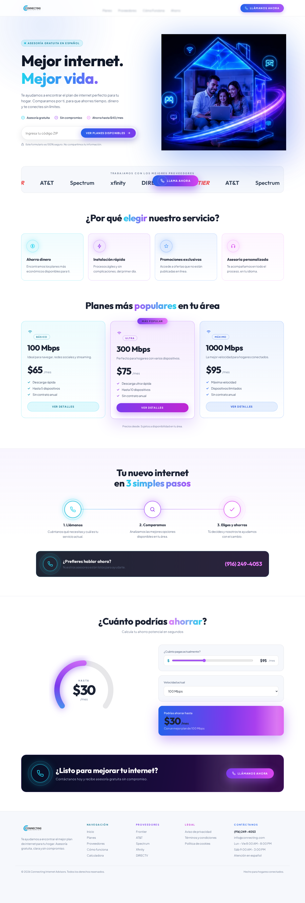

### Section Clips (screens/sections/)

*Clipped individual sections and components*


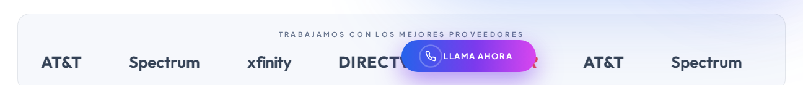

### Interaction States (screens/states/)

*Hover, focus, and active state captures*


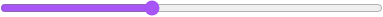

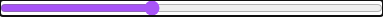


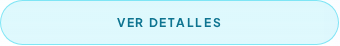

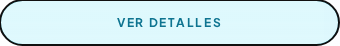

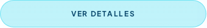

### Screenshot Index (screens/INDEX.md)

# Screenshot Index

## Scroll Journey

> Shows the cinematic state at each point of the page

| Scroll | Y Position | File |
|--------|-----------|------|
| 0% | 0px | `screens/scroll/scroll-000.png` |
| 17% | 571px | `screens/scroll/scroll-017.png` |
| 33% | 1107px | `screens/scroll/scroll-033.png` |
| 50% | 1678px | `screens/scroll/scroll-050.png` |
| 67% | 2249px | `screens/scroll/scroll-067.png` |
| 83% | 2785px | `screens/scroll/scroll-083.png` |
| 100% | 3356px | `screens/scroll/scroll-100.png` |

## Pages

| Page | URL | File |
|------|-----|------|
| home | `https://pagina-alexis-1-residencial.onrender.com` | `screens/pages/home.png` |

## Sections

| Page | Section | File |
|------|---------|------|
| home | #1 (section) | `screens/sections/home-section-1.png` |
| home | #2 (section) | `screens/sections/home-section-2.png` |

## Homepage Screenshots (screenshots/)


